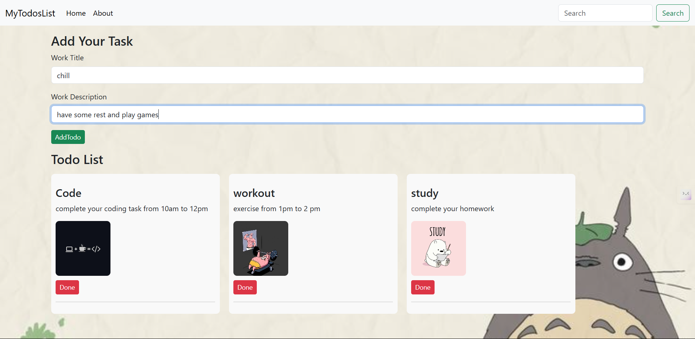

# Sam’s Work List 📝

A visually enhanced, component-based Todo List app built with **React** and **Hooks**.
Manage your task with the cozy animation of the task

---

## ✨ Features:

- 📋 Add new tasks with **title** and **description**
- 🖼️ Each task **automatically comes with a random relevant image** for better aesthetics
- 🗑️ Delete tasks by clicking the **"Done"** button
- 🎨 Responsive and clean layout with a **custom background image**
- 🖥️ Mobile and Desktop friendly UI and can work on both simultaniously
- 🖼️ **Sample Screenshot:**  
---


## Demo
👉 [Live Site on Vercel](https://sam-todo-tan.vercel.app)




---

## Tech Stack

- **React** (with Hooks: `useState`)  
- **Create React App**  
- **CSS** (global & component-level)  

---

## Installation

1. Clone the repo:  
   ```bash
   git clone https://github.com/75/Sam-Todo.git
   cd Sam-Todo
## author
sameer khan