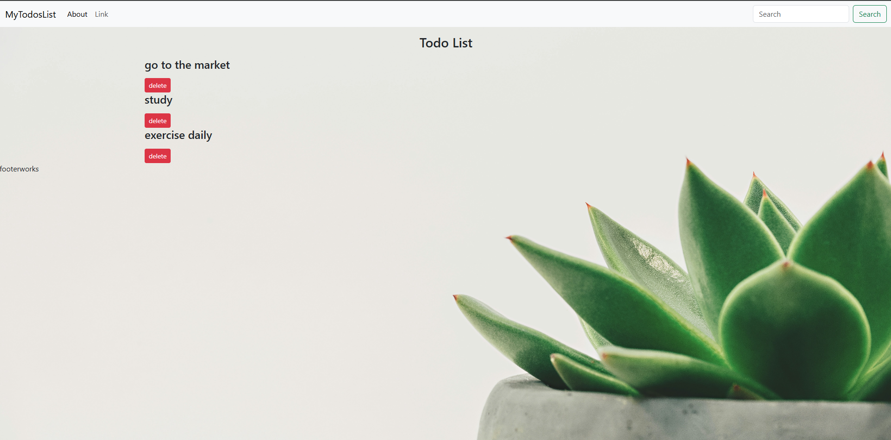

this is my personal app for managing the tasks

# Sam’s Todo List

A simple, component-based Todo List app built with React and Hooks. It demonstrates:

- Displaying a list of tasks  
- Deleting tasks  
- A clean, responsive layout  
- Custom background image support  

---

## Table of Contents

1. [Demo](#demo)  
2. [Tech Stack](#tech-stack)  
3. [Installation](#installation)  
4. [Usage](#usage)  
5. [Project Structure](#project-structure)  
6. [Features](#features)  
7. [Customization](#customization)  
8. [Available Scripts](#available-scripts)  
9. [Contributing](#contributing)  
10. [License](#license)  

---

## Demo



---

## Tech Stack

- **React** (with Hooks: `useState`)  
- **Create React App**  
- **CSS** (global & component-level)  

---

## Installation

1. Clone the repo:  
   ```bash
   git clone https://github.com/75/Sam-Todo.git
   cd Sam-Todo
